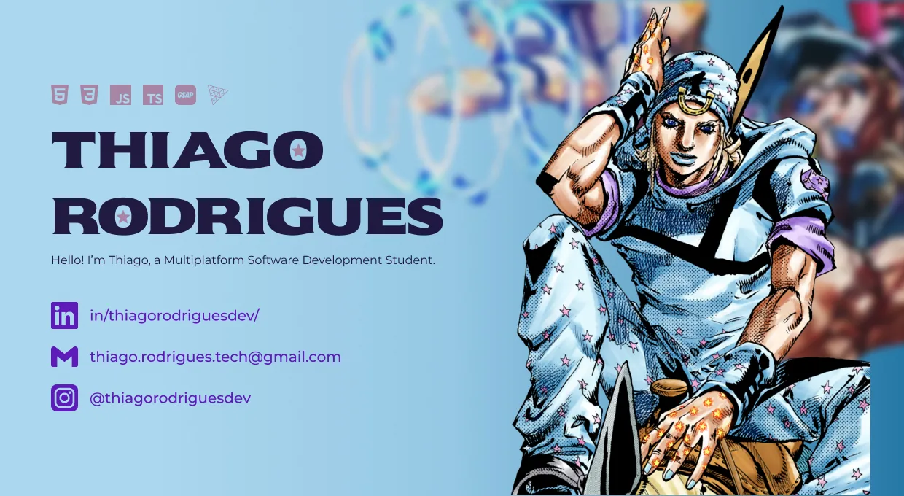

#

<h3>
🚀 Multiplatform Software Student focused on building modern, scalable and interactive applications.
</h3>

---

---

## 👨‍💻 About Me

* 💻 Multiplatform Software Development student passionate about building real-world applications
* ⚡ Creating modern interfaces, interactive experiences and scalable systems
* 🧠 Interested in software architecture, performance and clean code
* 🚀 Constantly learning and exploring new technologies

---

## 🧠 Tech Stack

### Languages

### Frameworks & Libraries

### Databases

### Tools

  
  
  
  

---

## ⚡ Github Stats

  <picture>
    <source
      srcset="https://github-readme-stats.vercel.app/api?username=codebythiago&show_icons=true&rank_icon=github&theme=dracula&hide_border=true&bg_color=00000000"
      media="(prefers-color-scheme: dark)"
    />
    <source
      srcset="https://github-readme-stats.vercel.app/api?username=codebythiago&show_icons=true&hide_border=true&bg_color=00000000"
      media="(prefers-color-scheme: light)"
    />
    
  </picture>

  <picture>
    <source
      srcset="https://github-readme-stats.vercel.app/api/top-langs/?username=codebythiago&layout=compact&theme=dracula&hide_border=true&bg_color=00000000"
      media="(prefers-color-scheme: dark)"
    />
    <source
      srcset="https://github-readme-stats.vercel.app/api/top-langs/?username=codebythiago&layout=compact&hide_border=true&bg_color=00000000"
      media="(prefers-color-scheme: light)"
    />
    
  </picture>

---

## 🔥 Contribution Activity

  <picture>
    <source
      srcset="https://github-readme-activity-graph.vercel.app/graph?username=codebythiago&theme=dracula&hide_border=true&bg_color=00000000"
      media="(prefers-color-scheme: dark)"
    />
    <source
      srcset="https://github-readme-activity-graph.vercel.app/graph?username=codebythiago&theme=github-light&hide_border=true&bg_color=00000000"
      media="(prefers-color-scheme: light)"
    />
    
  
  </picture>

---

## 🐍 Contribution Snake

  <picture>
    <source
      srcset="https://raw.githubusercontent.com/codebythiago/codebythiago/output/snake-dark.svg"
      media="(prefers-color-scheme: dark)"
    />
    
  
  </picture>

---

## ☕ Fun Fact

> I enjoy turning ideas into interactive digital experiences.

---

⭐ From [codebythiago](https://github.com/codebythiago)

